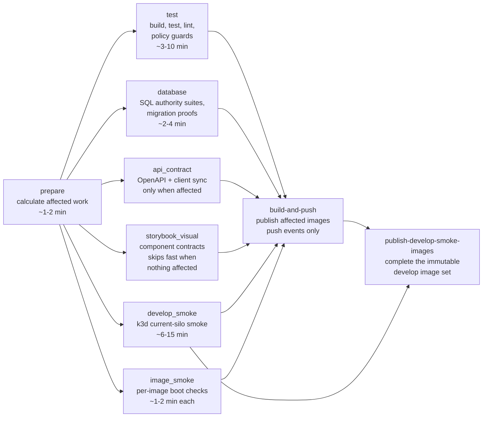
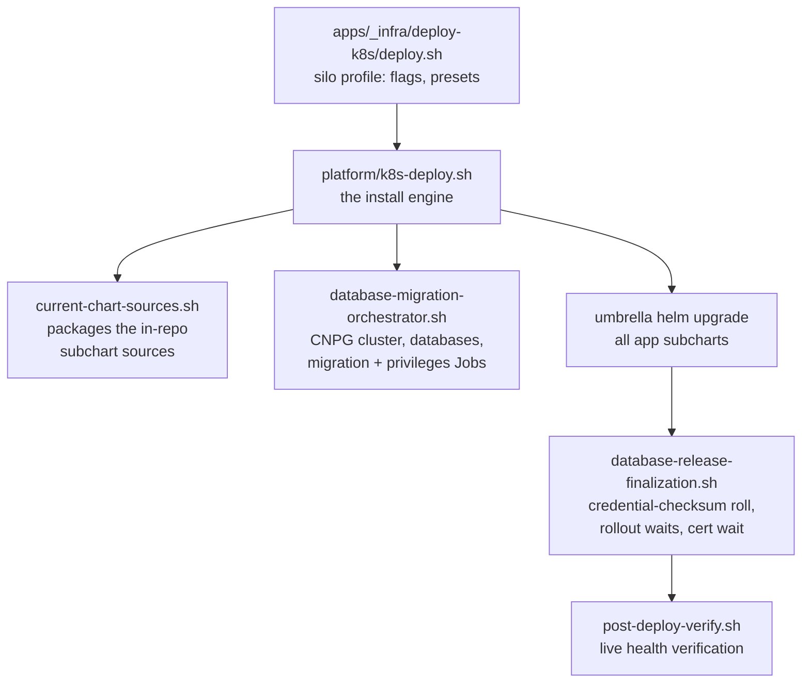

# CI and deployment

This is the reference for how a change travels from a pull request to a running cluster: the CI
pipeline and its gates, the caching that keeps it fast, the deploy engine, the warnings that save
hours, and the release-version and migration process. The contributor-facing summary lives on the
website under Contributing; this file is the deeper repository-side reference.

> See also: [`docs/agents/versioning.md`](agents/versioning.md) for the full release-version
> policy, [`docs/agents/infra.md`](agents/infra.md) for build/infra rules, and
> [`docs/agents/deploy-ledger.md`](agents/deploy-ledger.md) for the deploy fleet's cross-run notes.

## The pipeline at a glance

Three workflows run on every pull request: **Validate and publish affected deployables**
(`.github/workflows/docker.yml`, the main pipeline), **Enforce pull-request stack integrity**
(stacked-PR bookkeeping, under a minute), and **CodeQL** (static analysis, a few minutes). The
main pipeline is where the time goes:

What each job owns:

| Job | Purpose | Typical duration |
| --- | --- | --- |
| `prepare` | Computes the Nx affected graph, the deployable matrix, the guard comparison base, and whether the k3d smoke can be skipped. | 1–2 min |
| `test` | Builds, tests, and lints affected projects, and runs every policy guard: workload ownership, agent-domain boundary, mechanical style, module growth, release versioning, Prisma boundaries, config-docs coverage, dependency boundaries. | 3–10 min |
| `database` | Everything PostgreSQL-bound, beside `test` instead of inside it: the migration contracts and convergence proofs, the generated client, the target baseline, and the SQL authority suites. | 2–4 min |
| `api_contract` | Rebuilds the server and proves the OpenAPI reference and generated client are in sync. Runs only when the API contract changed. | skipped, or ~3–5 min |
| `storybook_visual` | Storybook build/behaviour/visual contracts for affected frontend projects, on cached Chromium. Runs beside `test`, not after it. | seconds when nothing affected; ~5 min otherwise |
| `develop_smoke` | Boots a disposable k3d cluster, deploys the full current silo through the real deploy scripts, and proves database isolation, TLS ingress, and workload health. The long pole of the pipeline. | 6–15 min |
| `image_smoke` | Boots individual images that declare an `image-smoke` target and checks they come up. | 1–2 min per image |
| `build-and-push` | Builds every affected deployable image and publishes `sha-<commit>` tags on push events. On pull requests it builds without pushing, as a proof. | 1–5 min warm |
| `publish-develop-smoke-images` | On develop pushes, completes the immutable image set for the commit: reuses the exact validated base image where nothing changed, copies tags forward, builds only what is missing. | seconds per image |

A deploy to a live cluster then consumes the published `sha-<commit>` images — CI must be green
for the exact SHA before any deploy (the deploy scripts do not build images).

## Caching layers

Every job runs on a fresh runner, so anything not cached is paid on every run. The pipeline uses
these caches, from cheapest to most impactful:

| Cache | Backend | Key | Used by |
| --- | --- | --- | --- |
| npm download cache | `actions/setup-node` | lockfile hash | all jobs |
| `node_modules` | `actions/cache` | lockfile hash | all jobs (skips `npm ci` entirely on a hit) |
| Nx computation cache | `actions/cache` (`.nx/cache`) | lockfile hash + commit, with prefix restore | `test`, `api_contract`, `storybook_visual` |
| Playwright Chromium | `actions/cache` (`~/.cache/ms-playwright`) | lockfile hash | `storybook_visual` |
| Docker image layers | **registry** (`ghcr.io/<owner>/opencrane-buildcache:<project>`) | buildx layer graph | `develop_smoke`, `build-and-push`, `publish-develop-smoke-images` |
| npm inside Dockerfiles | BuildKit cache mount (`/root/.npm`) | shared between build and runtime stages within one build | all Node images |

Design decisions worth knowing:

- **Image layers cache in the registry, not in the Actions cache.** The repository's 10GB Actions
  cache quota was permanently over budget — single buildkit blobs reach ~700MB — so layer caches
  were evicted almost immediately and every image built cold. Registry-backed caches
  (`type=registry`) have no such quota, and moving them out also stops the node/Nx caches from
  being evicted alongside.
- **The layer cache has a trust boundary.** Two cache repositories exist:
  `opencrane-buildcache` (trusted) is written only by integration-branch pushes and is the only
  cache a publishable build reads; `opencrane-buildcache-pr` is written and read by
  same-repository pull-request validation builds. A layer produced by unreviewed code therefore
  never becomes part of a published image. Fork pull requests read the trusted cache and write
  nothing (their token is read-only).
- **Chromium installs from cache, and the apt step is capped.** The browser binaries restore from
  the Actions cache; the apt-driven `--with-deps` install runs only on a cold cache and carries a
  ten-minute step timeout, because a hung apt once held an untimed job (and its runner) for hours.
- **Every job has a `timeout-minutes`.** A hung job does not only lose its own time — it occupies
  a concurrent-runner slot and starves every queued run behind it.

## The k3d smoke and its skip proof

The `develop_smoke` job is the pipeline's long pole and its most valuable gate: it exercises the
real deploy path end to end on every develop push. Two mechanisms keep its cost down:

1. **Image reuse by digest.** Projects the affected graph did not select are pulled from the
   validated base commit's published images instead of being rebuilt
   (`develop-smoke.sh:_pull_baseline_image`).
2. **The skip proof.** A pull request skips the k3d smoke entirely when its exact base SHA
   already completed the same k3d job successfully (`scripts/develop-smoke-baseline.mjs`). Any
   ambiguity — API failure, missing proof, affected containers — deliberately runs the smoke.

The skip proof is why **keeping develop green is a speed feature**: a red develop push means no
validated base exists, so every subsequent pull request pays the full smoke. A failure streak on
develop taxes every open PR in the repository.

The smoke's storage tier also varies: touching `k8s-deploy.sh`, the smoke script, the workflow,
or `apps/postgres/` selects the `full` tier, which additionally exercises CSI volume expansion
(several extra minutes). Other changes run the `fast` tier.

## Deploy infrastructure

All cluster mutation goes through app-owned scripts — never bare `helm upgrade` or `kubectl
apply` against a live cluster:

- `deploy.sh` installs one per-ClusterTenant silo: operator, channel proxy, LiteLLM, Cognee,
  opencrane-ui, per-CT networking, and one app-owned PostgreSQL server with isolated logical
  databases. Required flags: `--base-domain`, `--cluster-tenant`, `--acme-email`,
  `--first-user-email`; fresh installs also need `--opencrane-ui-digest` and `--cognee-digest`
  (immutable digests, never tags).
- **An upgrade keeps every image the prior release recorded unless this run names it.** Helm's
  reset-then-reuse cannot preserve an omitted override in a visible argument, so the engine reads
  the previous release's values and inherits whatever it finds. That means a version bump alone
  changes no image at all. To move images, name them:

  | To move | Pass |
  | --- | --- |
  | Server, channel proxy, memory gateway, artifact service | `--image-tag sha-<sha>` |
  | Server only | `--opencrane-server-tag sha-<sha>` |
  | Browser SPA | `--opencrane-ui-digest sha256:<digest>` |
  | Cognee | `--cognee-digest sha256:<digest>` |

  Every run logs the image it resolved for each component. Read those lines before assuming an
  upgrade shipped new code — a silo that deploys cleanly at a new chart version while still running
  the old server build looks healthy and behaves like the old release.
- Cluster-wide prerequisites (ingress-nginx, cert-manager, CloudNativePG) are installed once per
  cluster by `bootstrap-prerequisites.sh` and are never part of a silo release.
- The tagged 0.9.2 upgrade runs its reviewed IAM prerequisite and then Prisma from one immutable
  image in a bounded Helm hook Job. CloudNativePG first reconciles `pg_cron`, then reconciles the
  `cron` schema owner in a second observed `Database` generation, so the migration image receives
  only the OpenCrane application credential. A failure is returned directly;
  the deployer does not require a migration backup, inspect the source schema, pause writes, or roll
  back the application.
- After the umbrella upgrade, the engine stamps a checksum of the published database connection
  Secrets onto the consumer Deployments (`opencrane-server`, `litellm`). An
  unchanged checksum is a no-op; a changed one triggers exactly one rollout; and a fresh install
  skips the roll entirely because its pods were born after the Secrets were published. (This
  replaced an unconditional `rollout restart` that double-started the heaviest workloads on
  every deploy.)

## Warnings — read before deploying

- **CI green first.** Confirm the `docker.yml` run for the exact SHA is green before deploying;
  the deploy scripts pull published images and never build them.
- **Subchart packaging is derived, never committed.** Every umbrella dependency is an in-repo
  `file://` chart, so the checked-out commit is the version authority: the deploy fixture runs
  `helm dependency update --skip-refresh` and packages the current sources. There is no
  `Chart.lock` or vendored archive to regenerate, and a chart version bump needs no umbrella
  edit. (The bootstrap prerequisites are the opposite case: external charts stay pinned by
  version and digest.)
- **A green `helm template`/CI render does not prove a live `helm upgrade` works.** Stateful
  services need their PVC semantics, reconcile-retry, and Secret-change pod-roll trigger checked
  before deploying — see the live-upgrade checklist in the deploy ledger.
- **Never deploy with floating tags.** Public releases require `sha-*` build tags or digests; the
  qualified-release-image policy rejects `latest` and friends. Tag floating exists only for the
  disposable local k3d smoke.
- **The tenant's openclaw version pin lives in `values.yaml`, not in code defaults.**
- **Watch the queue, not only the jobs.** The org has a fixed number of concurrent runners; a
  workflow storm (or a hung job) can queue runs for 30+ minutes. If a run seems stuck before any
  job started, it is queue starvation, not a slow job.
- **Develop red = every PR pays the k3d smoke.** See the skip proof above. Fixing develop first
  is usually the fastest way to speed up everyone's PRs.
- **A cancelled develop push is normal.** The workflow's concurrency group replaces a queued push
  run when a newer push arrives; only in-flight publishes are protected.

## Release versions and migrations

The full policy lives in [`docs/agents/versioning.md`](agents/versioning.md); this is the working
summary.

- The root `package.json` version names the **repository train** (for example `0.9.2`). Each
  train has an immutable manifest `releases/<version>.json` recording every application's
  `adaptedVersion`, chart version, and the database schema version that work together.
- **Only applications whose own files changed stamp to the root version.** An application that
  changed only through a shared library, the root dependency set, or the lockfile keeps its
  latest released version — published images are pinned by commit SHA, so the shared change
  reaches it regardless. (Before this rule, every shared change failed CI until every manifest
  entry was bumped by hand.)
- A directly changed application updates, together: its manifest entry, its `package.json`
  version mirror, its `project.json` `metadata.release.adaptedVersion`, and its chart
  `appVersion` where a chart exists. Version-only mirror edits are "stamp-only" and do not count
  as changes themselves.
- A **changed chart** bumps its chart version to the root version and adds exactly one
  `helm/migrations/<from>-to-<to>.json` transition. The umbrella needs no edit: it declares its
  in-repo dependencies with open constraints and packages them fresh at render time.
- A **database schema change** updates the clean target baseline and adds one ordered Prisma change
  under `apps/opencrane/prisma/prisma-migrations/`. Released SQL transitions stay as history.
- Adjacent minor trains (`0.8.x → 0.9.0`) are the only automatic transition. Patch, skipped-minor,
  and major transitions require an approved `manualTransition` with a reason in the manifest.
- Once a version tag exists, that train's composition is frozen: any further change must advance
  the train and create the next manifest.

CI enforces all of this in the `test` job (`check:release-versioning`), diffed against the last
validated base, so a violation fails the PR — not the deploy.

## Letting an AI agent manage your deployment

The deploy path is scriptable end to end, which makes it a good fit for an agent-run loop (the
repository ships a `deploy` agent and a `/deploy-loop` skill that mutate clusters only through
the scripts above and triage every failure into a fix PR, an issue, or a design question).

The one thing an agent must never see in plain text is credentials. The convention:

- **`keys/` at the repository root is gitignored** (`/keys/*` in `.gitignore`). Put one secret
  per file, named for what it is:
  - `keys/initial-model-api-key` — the provider API key that seeds the first routable model.
    The deploy reads it as an environment variable, never as a flag:
    `OPENCRANE_INITIAL_MODEL_API_KEY="$(cat keys/initial-model-api-key)"` alongside
    `--initial-model-provider <openai|anthropic|gemini|mistral|deepseek|glm>`.
  - `keys/zitadel-pat` — the Zitadel service-user PAT for organisation management once the
    mode-scoped credential lands (tracked in the silo org-role issues); standalone silos get a
    full-org credential, fleet-mode silos a claims-only one.
- The agent reads a key file straight into the environment of the one command that needs it and
  never echoes it, logs it, or passes it as a command argument — the same custody rule the
  scripts themselves follow (the API key is environment-only precisely to keep it out of command
  history and Helm values).
- Everything else an agent needs is already non-secret: cluster context, base domain, tenant
  name, image digests from the release manifest, and the deploy ledger for cross-run memory.

With `keys/` populated, a fresh silo is one command the agent can compose, run, and verify —
and the post-deploy verification plus the run report tell it (and you) whether the cluster is
actually healthy.
