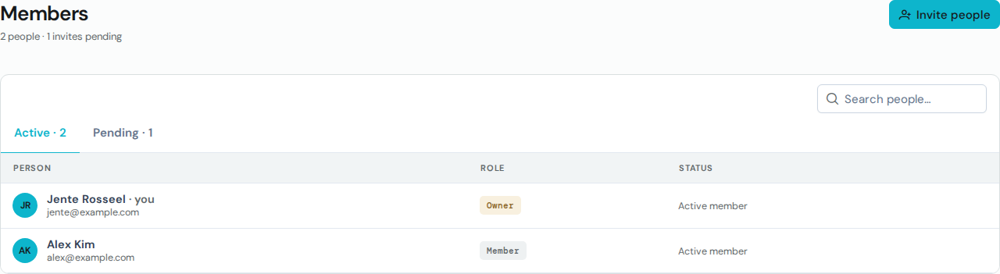
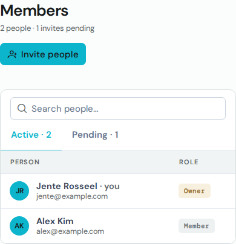
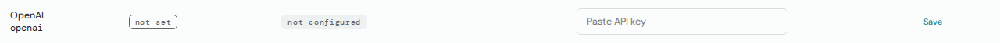
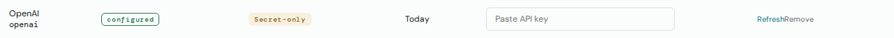
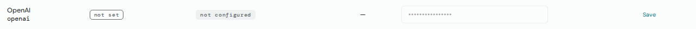
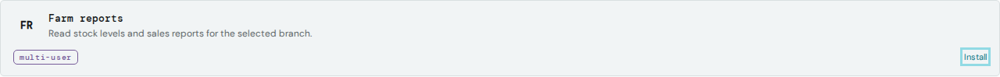
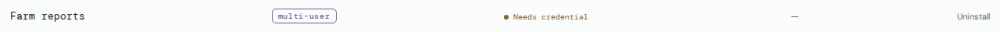
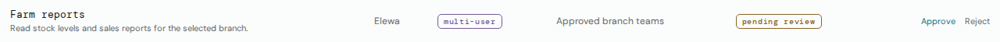
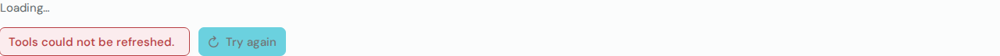
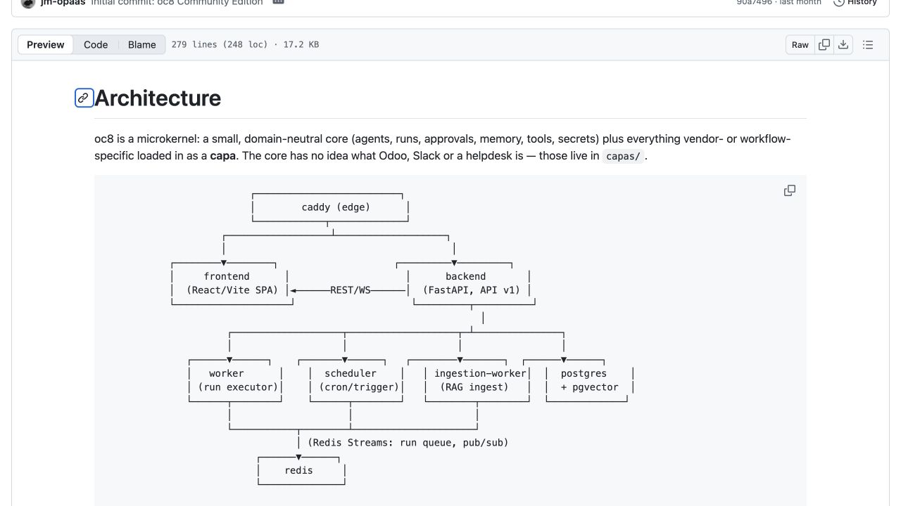

# Screenshot guide

Read with the [design brief](README.md) and [component handoff](components.md).

## Provenance and use

Images 1–10 are exact copies of committed Linux Storybook screenshots from OpenCrane `967f7c0b6`. They show isolated component/feature fixtures, not a live authenticated installation. Their original capture date and browser build are not asserted here. Synthetic names/emails come from fixtures. The files were selected and copied on 25 September 2026.

The canonical test references remain under `tests/storybook/__screenshots__/linux/`. These copies freeze the design discussion; do not update them as test baselines. [manifest.json](screenshots/manifest.json) records original path, revision, dimensions and SHA-256 for every image. Keep/Fix/Extend are design recommendations, not prior visual approval.

## 1. Keep: member directory hierarchy

Use the clear page title, primary invitation action, search, tabs and identity/role/status columns. Extend with member detail and access-management actions; these are not shown here.

[Original repository image](../../../tests/storybook/__screenshots__/linux/settings-members--ready.png)

## 2. Keep and extend: narrow layout

Use as the existing 390px reference. Design the new detail, review and failure states at the same width.

[Original repository image](../../../tests/storybook/__screenshots__/linux/settings-members--ready-narrow.png)

## 3. Extend: provider setup

Keep write-only key entry. Add provider context, verification, model choice and access as a coherent journey.

[Original repository image](../../../tests/storybook/__screenshots__/linux/tools-model-key-row--unconfigured.png)

## 4. Fix: saved is not ready

The persisted-key state is visible but Secret-only is technical and the actions visually crowd together. Replace it with a plain explanation and a specific verification/recovery action. Do not copy the action spacing.

[Original repository image](../../../tests/storybook/__screenshots__/linux/tools-model-key-row--secret-only.png)

## 5. Extend: command progress

Keep pending state scoped to one provider. Add meaningful progress and interrupted-operation recovery; a busy row alone cannot explain an uncertain result.

[Original repository image](../../../tests/storybook/__screenshots__/linux/tools-model-key-row--saving.png)

## 6. Extend: catalogue decision

Keep the business description and explicit installation action. Add publisher/version, account ownership and prerequisites without confusing installation with readiness.

[Original repository image](../../../tests/storybook/__screenshots__/linux/tools-catalogue-card--available.png)

## 7. Fix: an incomplete state needs a way forward

The screenshot shows Needs credential with only Uninstall. Design Connect account or Repair connection once the matching backend capability exists. This story fixture is not evidence of the supported authentication mode of a deployed integration.

[Original repository image](../../../tests/storybook/__screenshots__/linux/tools-installed-row--needs-credential.png)

## 8. Extend: approval with context

Keep governance separate from connection readiness. Expose audience, actions and changed permissions before approval; do not grant access simply because an item is installed.

[Original repository image](../../../tests/storybook/__screenshots__/linux/tools-governance-row--pending-review.png)

## 9. Reuse: retained data and read failure

A failed refresh can preserve previously loaded information. Distinguish this read retry from mutation retry; never replay a write through the same generic action.

[Original repository image](../../../tests/storybook/__screenshots__/linux/foundation-resource-feedback--retryable-failure.png)

## 10. Reuse: retry in progress

Use consistent feedback during a retry. Add accessible announcements and retain the operation-specific next step.

[Original repository image](../../../tests/storybook/__screenshots__/linux/foundation-resource-feedback--retrying.png)

## 11. OC8: explain the system before its details

A browser screenshot captured on 25 September 2026 from the public [OC8 architecture document at 314c6842](https://github.com/oc8-ai/oc8/blob/314c6842acdc7e53a1f485b91e306dfa45c82937/ARCHITECTURE.md). It shows the upper diagram excerpt, not the entire topology or an OC8 product screen. Attribution: oc8-ai/oc8 contributors; upstream licensing is recorded in their [LICENSE](https://github.com/oc8-ai/oc8/blob/314c6842acdc7e53a1f485b91e306dfa45c82937/LICENSE). GitHub chrome belongs to GitHub. This reference is not an OpenCrane asset or endorsement.

Borrow the short introduction, recognisable service names and explicit responsibilities. For OpenCrane, put the organisation boundary, current permission authority, history and temporary compute in their correct places. Do not copy OC8 deployment choices or present unfinished tool/memory flows as ready.

## What the designer still needs to produce

The target setup screens, model list/editor, connection wizard, update comparison, member detail and removal confirmations do not exist in this reference set. Produce annotated proposed designs with the state coverage in the brief. Do not manufacture product screenshots or label a prototype as a deployed capability.
