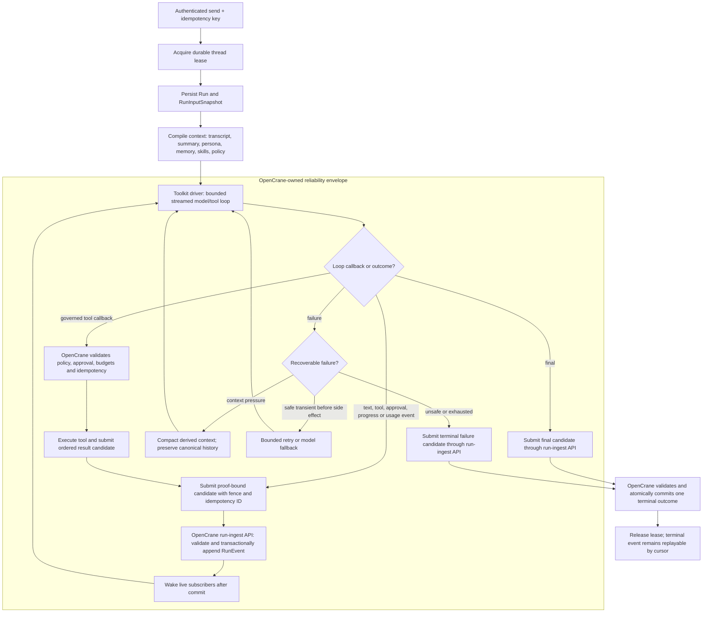

# OpenClaw agent-loop investigation and replacement plan

Status: **adopted direct-refactor plan — 2026-07-18.** This document is an implementation-level
investigation of the OpenClaw runtime pinned by this repository and the plan for replacing its
agentic behavior directly with a smaller toolkit-backed OpenCrane runtime.

It refines the runtime choice in the
[personal-agent platform architecture](personal-agent-platform-architecture.md). It defines the
runtime slice's target contracts, conformance gate, reliability envelope, and same-slice deletion
boundary.

## Executive conclusion

OpenClaw does not have one indivisible "agentic loop." It has three layers:

1. a small model/tool loop in the private `@openclaw/agent-core` package;
2. a much larger attempt and recovery envelope that builds context, serializes a session, compacts,
   retries, changes models, and tears down safely;
3. a product runtime around that envelope: Gateway v4, session routing, JSONL transcripts, live
   events, plugin hooks, workspace/persona loading, channel delivery, and runtime configuration.

The small loop is conventional: stream a model response, execute its tool calls, append tool
results, and call the model again until there are no tool calls or queued messages. The behavior
users experience as "OpenClaw" comes mostly from layers 2 and 3. Replacing only the inner loop would
therefore create a demo, not a production replacement.

The recommended direction is:

- make OpenCrane the canonical owner of `Thread`, `Message`, `Run`, ordered `RunEvent`, approval,
  usage, transcript context, compaction, retry, budget, identity, memory, and tool policy;
- use a toolkit only as the bounded model-to-tool-turn engine;
- spike the **TypeScript OpenAI Agents SDK** first and Vercel AI SDK's `ToolLoopAgent` against the
  same black-box conformance suite;
- choose the OpenAI Agents SDK if its LiteLLM path, resumable approvals, cancellation, and event
  semantics pass; choose AI SDK if its thinner, provider-neutral loop proves materially safer;
- build a minimal custom loop only if both toolkits fail a hard gate;
- replace the backend behind the existing frontend `ConversationGateway`, but introduce an
  OpenCrane-owned run/event protocol rather than reproducing Gateway v4;
- prove the target product contract, then delete the OpenClaw installer, config, protocol,
  workspace, plugin, and transcript paths in the same replacement slice.

This investigation establishes the evidence for a **TypeScript** default and refines the wider
architecture around a conformance-selected loop driver. Python remains appropriate for isolated
user-authored tool Jobs; it is not a reason to add a second implementation language to the
conversational runtime.

## Investigation baseline

The evidence below is pinned to the exact upstream runtime selected by this repository:

- OpenClaw tag: `v2026.6.11`
- upstream commit: `e085fa1a3ffd32d0ea6917e1e6fb4ecbffbb77d2`
- local pins: the [runtime entrypoint](../../apps/feat-openclaw-tenant/deploy/entrypoint.sh),
  [OpenCrane config](../../apps/opencrane/src/app/config.ts), and
  [infra values](../../apps/_infra/deploy-k8s/values.yaml)

Current OpenClaw `main` may differ. The pinned artifact is evidence for understanding and deleting
the current implementation only. Target conformance fixtures are authored independently from the
product contract and must not target or derive from any OpenClaw artifact.

## How a web-chat turn really runs

### End-to-end call path

For the OpenCrane web UI, the concrete path is:

1. [`OpenClawConversationGateway.send()`](../../libs/frontend/state/conversation/adapter/src/lib/openclaw-conversation-gateway.ts)
   sends Gateway v4 `chat.send` with a session key and idempotency key.
2. The trusted [gateway proxy](../../libs/server/_infra/channel-proxy/src/gateway-proxy/proxy.ts) validates the
   browser origin, delegates identity and tenant resolution to the control plane, strips a forged
   identity header, injects the verified user, and forwards the WebSocket to the user's pod.
3. OpenClaw's
   [`chat.send` handler](https://github.com/openclaw/openclaw/blob/e085fa1a3ffd32d0ea6917e1e6fb4ecbffbb77d2/src/gateway/server-methods/chat.ts#L3132-L3330)
   validates and sanitizes the request, resolves the session and agent, and uses the client
   idempotency key as the run id. It then performs
   [run admission, abort registration, attachment staging and early acknowledgement](https://github.com/openclaw/openclaw/blob/e085fa1a3ffd32d0ea6917e1e6fb4ecbffbb77d2/src/gateway/server-methods/chat.ts#L3382-L3612)
   before the
   [asynchronous inbound dispatch](https://github.com/openclaw/openclaw/blob/e085fa1a3ffd32d0ea6917e1e6fb4ecbffbb77d2/src/gateway/server-methods/chat.ts#L3620-L3998).
4. The auto-reply pipeline resolves commands, directives, hooks, queue behavior, and delivery, then
   reaches `runReplyAgent` and
   [`runAgentTurnWithFallback`](https://github.com/openclaw/openclaw/blob/e085fa1a3ffd32d0ea6917e1e6fb4ecbffbb77d2/src/auto-reply/reply/agent-runner-execution.ts#L1564-L1775).
5. `runAgentTurnWithFallback` calls
   [`runEmbeddedAgent`](https://github.com/openclaw/openclaw/blob/e085fa1a3ffd32d0ea6917e1e6fb4ecbffbb77d2/src/agents/embedded-agent-runner/run.ts#L602-L647).
   CLI/operator `agent` requests take another ingress path, but converge on the same embedded
   runner through `runAgentAttempt`.
6. The runner resolves a
   [per-session lane and a global lane](https://github.com/openclaw/openclaw/blob/e085fa1a3ffd32d0ea6917e1e6fb4ecbffbb77d2/src/agents/embedded-agent-runner/run.ts#L622-L772),
   selects the built-in
   [`openclaw` harness](https://github.com/openclaw/openclaw/blob/e085fa1a3ffd32d0ea6917e1e6fb4ecbffbb77d2/src/agents/embedded-agent-runner/run.ts#L1043-L1062),
   then executes attempts under timeout, cancellation, compaction, and fallback controls.
7. The attempt layer obtains the
   [transcript ownership and write lock](https://github.com/openclaw/openclaw/blob/e085fa1a3ffd32d0ea6917e1e6fb4ecbffbb77d2/src/agents/embedded-agent-runner/run/attempt.ts#L2097-L2257),
   opens the session, builds workspace, persona, skills, tools, policy and model context, subscribes
   to events, and
   [calls `session.prompt()`](https://github.com/openclaw/openclaw/blob/e085fa1a3ffd32d0ea6917e1e6fb4ecbffbb77d2/src/agents/embedded-agent-runner/run/attempt.ts#L3403-L3428).
8. The harness invokes the small `@openclaw/agent-core` loop, persists completed messages, and
   emits normalized internal lifecycle events.
9. The outer runner classifies the outcome. It may compact and retry, trim tool results, rotate an
   auth profile or model, or replay the complete primary-to-fallback chain once after a classified
   transient HTTP failure. That last retry is described as "before reply" upstream but is not gated
   by the runner's potential-side-effect state in the
   [transient retry path](https://github.com/openclaw/openclaw/blob/e085fa1a3ffd32d0ea6917e1e6fb4ecbffbb77d2/src/auto-reply/reply/agent-runner-execution.ts#L3206-L3218);
   the replacement must make that retry safer rather than preserve it blindly.
10. Gateway delivery folds cumulative assistant snapshots and tool/session events back into `chat`
    events. The frontend adapter folds those into `ThreadMessage` objects and later reconstructs
    history from a growing tail fetch.

OpenClaw's public "agent loop" description is directionally correct, but the source path above is
the operational definition that matters for replacement.

### The actual inner loop

The private core implementation is compact. Its
[`runLoop`](https://github.com/openclaw/openclaw/blob/e085fa1a3ffd32d0ea6917e1e6fb4ecbffbb77d2/packages/agent-core/src/agent-loop.ts#L258-L432)
does this:

```text
append queued steering messages
stream one assistant response
if response is error/aborted: finish
collect every tool call
execute the batch sequentially when required, otherwise in parallel
append tool results in the assistant's original call order
rebuild context/model state for the next turn
repeat while tools or steering messages remain
drain queued follow-up messages
finish when no tools and no queued messages remain
```

Important details are easy to miss:

- Assistant text, reasoning, and tool-call fragments are emitted as start/update/end lifecycle
  events while the provider stream is consumed.
- A tool can force sequential execution; otherwise calls run concurrently, but result messages are
  appended in original call order.
- Unknown tools, malformed arguments, policy blocks, aborts, and execution exceptions become
  model-visible error tool results instead of crashing the loop.
- `beforeToolCall` can block; `afterToolCall` can rewrite a result or mark it terminating. The batch
  terminates only when every executed result requests termination.
- Steering messages enter before the next model call. Follow-ups can restart the outer loop after a
  turn would naturally finish.
- Abort produces a persisted terminal assistant outcome so the next session operation does not
  continue from a dangling tool-call message.

The implementation evidence is in
[`streamAssistantResponse`](https://github.com/openclaw/openclaw/blob/e085fa1a3ffd32d0ea6917e1e6fb4ecbffbb77d2/packages/agent-core/src/agent-loop.ts#L438-L535),
[`executeToolCalls`](https://github.com/openclaw/openclaw/blob/e085fa1a3ffd32d0ea6917e1e6fb4ecbffbb77d2/packages/agent-core/src/agent-loop.ts#L540-L739),
and the
[`prepare/execute/finalize` path](https://github.com/openclaw/openclaw/blob/e085fa1a3ffd32d0ea6917e1e6fb4ecbffbb77d2/packages/agent-core/src/agent-loop.ts#L789-L1043).

Do not depend directly on this package. Its manifest marks it
[`0.0.0-private` and `private: true`](https://github.com/openclaw/openclaw/blob/e085fa1a3ffd32d0ea6917e1e6fb4ecbffbb77d2/packages/agent-core/package.json#L1-L5).
It is an excellent executable specification, not a supported extraction seam.

### The production behavior is in the envelope

The OpenClaw harness and embedded runner add the difficult behavior around that loop:

| Concern | What the pinned runtime does | Replacement implication |
|---|---|---|
| Session serialization | Per-session command lane, global capacity lane, transcript file-owner guard, and process-aware write lock | Use a durable one-active-run lease per thread plus bounded global worker capacity |
| Transcript | `sessions.json` metadata plus append-only, tree-structured `<sessionId>.jsonl` messages, tool results and compaction entries | Do not carry it forward; create the immutable Postgres message/event history from the target contract |
| Context construction | Rebuilds system prompt, active tools, workspace bootstrap, skills, provider fixups and session branch before calls | Create one versioned OpenCrane `RunInputSnapshot` and prompt compiler |
| Persistence timing | Appends each completed message; flushes queued session mutations at turn end; emits a save point and settled event | Persist normalized events transactionally before exposing them; never trust only an in-memory stream |
| Tool lifecycle | Resolve, validate, policy hook, execute with partial updates, result hook, append result, continue | Keep authorization and idempotency outside the toolkit adapter |
| Cancellation | Run and lane abort controllers propagate through model and tool execution; teardown still writes terminal state and releases locks | Abort must reach provider and tool, and exactly one durable terminal event must win |
| Compaction | Semantic summary plus intact recent tail and tool-call/result pairs; context-overflow and high-token timeout can compact and retry | Keep canonical history immutable; derive a provider-neutral context projection and version its summary |
| Recovery | Bounded retries for overflow, timeout, empty/missing response, unsupported reasoning, transient provider failures, auth profile/model fallback, and interrupted post-compaction continuation | Implement an explicit error taxonomy and retry matrix; do not inherit opaque SDK retries |
| Runaway protection | A finite outer recovery-attempt limit and idle-timeout breaker; rolling tool-loop detection is off by default, while the narrow post-compaction repeated-result guard is on unless explicitly disabled. The inner model/tool loop has no independent turn cap | Add aggregate deadline, cost, token, model-turn, tool and repeated-no-progress budgets rather than claiming exact parity |
| Subagents | `sessions_spawn` creates an independent child session/run with depth, child-count and sandbox policy; a registry later injects completion back into the requester | Model child runs and completion delivery durably; do not treat an SDK handoff as sufficient orchestration |
| Hooks/plugins | Prompt, provider, tool, message, compaction, session and delivery hooks can change behavior | Replace only needed behavior with typed OpenCrane policy/events; do not reproduce a generic plugin kernel |
| Delivery | Gateway acknowledges, broadcasts cumulative deltas/tool events, tracks recipients, mirrors special replies and supports reconnect | Persist ordered `RunEvent`s and replay by cursor; delivery becomes a projection |

The production `AgentSession`, rather than the unused generic core harness, subscribes to core
events and owns session persistence, extension hooks, retry/compaction integration, and steering /
follow-up queues. See its
[`event subscription`](https://github.com/openclaw/openclaw/blob/e085fa1a3ffd32d0ea6917e1e6fb4ecbffbb77d2/src/agents/sessions/agent-session.ts#L425-L427),
[`steering and follow-up queue state`](https://github.com/openclaw/openclaw/blob/e085fa1a3ffd32d0ea6917e1e6fb4ecbffbb77d2/src/agents/sessions/agent-session.ts#L345-L350),
[`queueing methods`](https://github.com/openclaw/openclaw/blob/e085fa1a3ffd32d0ea6917e1e6fb4ecbffbb77d2/src/agents/sessions/agent-session.ts#L1352-L1422), and
[`message-end persistence`](https://github.com/openclaw/openclaw/blob/e085fa1a3ffd32d0ea6917e1e6fb4ecbffbb77d2/src/agents/sessions/agent-session.ts#L564-L665).
The pinned session format and lock behavior are documented in OpenClaw's
[`session-management-compaction.md`](https://github.com/openclaw/openclaw/blob/e085fa1a3ffd32d0ea6917e1e6fb4ecbffbb77d2/docs/reference/session-management-compaction.md#L31-L104).
Compaction keeps full history on disk while changing the model view, and preserves tool-call/result
pairs at the cut boundary; see the pinned
[`compaction` documentation](https://github.com/openclaw/openclaw/blob/e085fa1a3ffd32d0ea6917e1e6fb4ecbffbb77d2/docs/concepts/compaction.md#L9-L24).

The recovery loop is finite, not a blind `while (true)`: the pinned runner resolves a total attempt
limit and separately caps timeout-driven compaction at two and overflow compaction at three
attempts. It also permits one narrowly guarded continuation when compaction interrupted a final
answer and no potential side effect occurred. See the
[`run-loop counters and breaker state`](https://github.com/openclaw/openclaw/blob/e085fa1a3ffd32d0ea6917e1e6fb4ecbffbb77d2/src/agents/embedded-agent-runner/run.ts#L1556-L1604),
[`total attempt guard`](https://github.com/openclaw/openclaw/blob/e085fa1a3ffd32d0ea6917e1e6fb4ecbffbb77d2/src/agents/embedded-agent-runner/run.ts#L1881-L1906),
and
[`post-compaction continuation guard`](https://github.com/openclaw/openclaw/blob/e085fa1a3ffd32d0ea6917e1e6fb4ecbffbb77d2/src/agents/embedded-agent-runner/run.ts#L3818-L3837).

Subagents do not recurse inside `runLoop`. The
[`sessions_spawn` path](https://github.com/openclaw/openclaw/blob/e085fa1a3ffd32d0ea6917e1e6fb4ecbffbb77d2/src/agents/subagent-spawn.ts#L1070-L1278)
creates a separately governed child session and re-enters the same agent runtime with a new run id;
the durable registry and
[`completion announcement`](https://github.com/openclaw/openclaw/blob/e085fa1a3ffd32d0ea6917e1e6fb4ecbffbb77d2/src/agents/subagent-announce.ts#L479-L607)
wake or notify the requester later. OpenCrane therefore needs parent/root run lineage, child budgets,
and idempotent completion delivery outside the selected toolkit.

### Target control flow

The toolkit belongs inside the OpenCrane reliability envelope, not around it:



The diagram is a logical envelope across the runtime and `apps/opencrane`; it does not imply runtime
database access. The driver contract is live, not turn-buffered. `LoopEventSink` receives model
deltas, tool lifecycle, approval, progress, usage, and child-run signals while the step that produced
them is still executing. Raw toolkit callbacks are event candidates. The adapter may coalesce only
high-frequency model deltas into one bounded `message.delta` candidate before persistence; tool,
approval, artifact, usage, and terminal transitions keep their semantic boundaries. The reliability
envelope then submits the candidate to the workload-authenticated internal run-ingest API with its
run proof, attempt, fencing token and stable candidate ID. Model output and model-derived completion/
ordinary-failure candidates also carry the input generation used for that model request. The
OpenCrane writer validates it,
transactionally assigns the next `(runId, sequence)`, persists it, and wakes SSE subscribers.
Retrying `(runId, attempt, candidateId)` returns the same event. The UI may therefore render partial
text, the active tool, elapsed time, progress, and approval state without waiting for the run to
finish.

Candidate formation may use a small bounded latency/size window, but it may not buffer an entire
model turn or tool execution. Once formed, the canonical event is never delivery-only or
re-coalesced into a different history. Long-running tools emit rate-bounded heartbeats or progress
events even when they have no user-facing output. A disconnected client resumes after its last
applied sequence and receives the same events from Postgres before rejoining the live tail. Abort
and approval decisions remain authenticated HTTP commands, while SSE is the initial one-way event
transport.

## What must be replicated—and what must not

Replicate the product behavior that OpenCrane currently relies on:

- streamed assistant text and structured tool lifecycle;
- ordered, durable user/assistant/tool-result history;
- per-thread serialization, duplicate-send suppression and safe abort;
- tool argument validation, authorization, approvals and model-visible failures;
- sequential and parallel tool execution with deterministic transcript ordering;
- mid-run steering through canonical user messages considered at the next model-decision boundary;
- context-window management, semantic compaction and intact tool pairs;
- bounded provider/auth/model recovery and one terminal outcome;
- reconnect/replay, usage accounting, trace correlation and crash reconciliation;
- persona, entitled skills, Cognee recall/capture, LiteLLM routing and Obot MCP policy at the same
  semantic points in a run.

Do **not** reproduce OpenClaw implementation choices that are not product requirements:

- Gateway v4 schemas, device pairing, nodes, channel routing, cron, admin/config RPCs or runtime
  self-update;
- `sessions.json`, JSONL as the live authority, tail-window history, workspace marker files or
  mutable persona files;
- OpenClaw's plugin/hot-reload surface, generic hook vocabulary or channel-delivery pipeline;
- its exact error text, synthetic bookkeeping entries, file locking, session-key grammar or tree
  navigation unless a proven UI requirement depends on one;
- OpenClaw's built-in memory and tool policy when Cognee and Obot are the accepted authorities.

The goal is the independently approved OpenCrane product contract. OpenClaw behavior is not a
compatibility target, fixture source, oracle, or acceptance baseline.

## Current OpenCrane seam and missing contract

The frontend already depends on the runtime-neutral
[`ConversationGateway`](../../libs/frontend/state/core/src/lib/conversation-gateway.types.ts), and the
OpenClaw adapter is replaceable. That interface is not yet a sufficient server protocol. It lacks:

- explicit run identifiers and terminal run states;
- ordered event sequence/cursor semantics and replay checkpoints;
- durable approval pause/resume;
- attachment input and artifact references as first-class contracts;
- durable usage, budget and classified error records;
- explicit request, abort, tool-call and approval idempotency;
- a true history cursor—the existing adapter grows a tail query to 1,000 rows.

Introduce a transport-neutral backend contract before selecting the final toolkit:

```ts
interface AgentLoopDriver
{
  run(
    request: LoopRequest,
    sink: LoopEventSink,
    steering: LoopSteeringSource,
    signal: AbortSignal,
  ): Promise<LoopOutcome>;
}

interface LoopSteeringSource
{
  claimAtBoundary(boundary: LoopSteeringBoundary): Promise<LoopSteeringBatch | null>;
}

interface LoopSteeringBoundary
{
  boundaryId: string;
}

interface LoopSteeringBatch
{
  absorptionId: string;
  inputGeneration: number;
  messageIds: string[];
  messages: ModelMessage[];
}

type LoopRequest =
  | { kind: 'start'; input: LoopInput }
  | { kind: 'resume'; input: LoopInput; checkpoint: LoopCheckpointEnvelope; decisions: LoopDecision[] };

interface LoopInput
{
  runId: string;
  model: ResolvedModel;
  systemPrompt: string;
  context: ModelMessage[];
  tools: GovernedTool[];
  budgets: RunBudgets;
}

interface LoopCheckpointEnvelope
{
  driverId: string;
  driverVersion: string;
  runtimeVersion: string;
  formatVersion: number;
  inputSnapshotHash: string;
  payloadSha256: string;
  encryptedPayload: Uint8Array;
}

interface LoopInterruption
{
  interruptionId: string;
  toolCallId: string;
  toolName: string;
  argumentsHash: string;
}

interface LoopDecision
{
  interruptionId: string;
  outcome: 'approved' | 'rejected';
  rejectionMessage?: string;
}

type LoopOutcome =
  | { kind: 'completed'; usage: ModelUsage }
  | { kind: 'paused'; interruptions: LoopInterruption[]; checkpoint: LoopCheckpointEnvelope }
  | { kind: 'failed'; error: ClassifiedLoopError }
  | { kind: 'cancelled' };
```

SDK classes and event types stop at this adapter. The durable checkpoint contract contains only the
neutral envelope; its encrypted driver payload is a replaceable execution cache, not canonical
approval, tool, transcript or run state. A driver that cannot safely deserialize an old payload may
resume from normalized OpenCrane state only when it can prove that no visible output or tool dispatch
will be replayed. SDK types must not enter public APIs, frontend state, tool policy, or Cognee/Obot
contracts.

Steering is pull-based at a safe model-decision boundary: after the current model response, ordered
tool results, or approval outcome is durably represented and before the next model request. The
runtime shell supplies `LoopSteeringSource`; it binds run proof, attempt, fence, current input
generation, and acknowledged cursor internally. The toolkit adapter supplies only a neutral,
deterministic boundary ID and inserts returned messages once; writer-authority data never enters the
toolkit adapter. The shell's event sink associates later candidates with the returned generation.

A message arriving during a tool or sandbox execution does not silently cancel that action. A
message arriving while approval is pending does not change the exact approved tool call; it is
eligible after the approval outcome and tool result have been recorded. Drivers never emit
`steering.*` events; those are created only by OpenCrane's send, claim, and terminal transactions.

`claimAtBoundary` is not an in-memory queue drain. The shell-owned source calls an authenticated
OpenCrane endpoint with its bound run proof, attempt, fence, current generation, acknowledged cursor,
and the adapter's stable boundary ID. The sole OpenCrane writer atomically claims
all eligible canonical Messages in thread order, appends one `steering.absorbed` event containing
only stable IDs, and returns the immutable batch. Repeating the same boundary returns the same batch
and event. Recovery reconstructs context from the initial `RunInputSnapshot` plus canonical absorbed
message IDs; a toolkit checkpoint is never the authority for whether input was consumed.

The steering claim and terminal transition serialize on the active run. Each successful claim
increments the canonical `inputGeneration` and returns it with the batch; model output and a
model-derived completion or ordinary-failure candidate carry the generation used for their model
request. If the claim commits first, a model-derived terminal candidate from the previous generation
is rejected with a continue outcome and cannot close the run. Only such a candidate whose expected
generation equals the row-locked current generation may commit. If the normal terminal transaction
locks first, it appends `steering.deferred` immediately before the terminal event and creates or
reuses the idempotent next run for still-queued Messages in the same transaction. A send that arrives
after termination starts that next run directly.

Abort/cancel, deadline, budget, security or policy revocation, and lease loss are authoritative stop
transitions, not model-derived terminal candidates. Under the same row lock they fence execution and
commit exactly one terminal event regardless of input generation. Unclaimed Messages receive a
durable `steering.deferred` pending disposition and may enter a later run only through normal
authorized admission; a policy or budget stop cannot be bypassed by automatic re-run. Messages
already recorded as `steering.absorbed` remain attached to the stopped run and are not silently
replayed. The UI shows that the run stopped before further model work; an explicit authorized retry
may reference that input without creating another canonical Message.

Enqueue uses the same thread/active-run serialization. The send transaction locks the thread's
active-run pointer and target run before deciding its disposition. If enqueue wins, the Message and
`steering.queued` belong to the active run and a later terminal transaction must absorb-or-defer it.
If termination wins, send creates or reuses the next run directly. It never appends to a closed run
or leaves a canonical Message without an owning disposition.

This inbox is an ordered Postgres control-plane record, not the background provisioning/indexing
work queue. `RunInputSnapshot` stays immutable; absorbed steering is an append-only input supplement.
A repeated or stale-fenced claim cannot advance the generation, and recovery derives the current
generation from canonical Run state and absorption events.

### Canonical run model

At minimum, define:

- `Thread`: silo, participants, current context-revision pointer and timestamps;
- `Message`: immutable user/assistant/tool/system record, stable content blocks and provenance;
- `Run`: request idempotency key, parent/root lineage, state, input snapshot, absorbed-input
  generation, model route, budgets, usage and terminal classification;
- `RunEvent`: `(runId, sequence)` ordered event log with a stable event vocabulary;
- `ToolInvocation`: stable call id, policy decision, approval, dispatch idempotency key, side-effect
  state and result reference;
- `Approval`: requested/approved/rejected/expired state plus actor and policy evidence;
- `RuntimeCheckpoint`: neutral driver/runtime/schema versions, input hash, encrypted payload
  reference and lifecycle; never the authority for an approval or tool side effect;
- `ContextRevision`: summary, first included message, intact tail boundary, token estimate, model and
  prompt-policy version;
- `ArtifactRef`: attachment/tool output pointer and access policy.

Recommended public event vocabulary:

```text
run.accepted
run.started
message.started
message.delta
message.completed
tool.requested
tool.approval_required
tool.started
tool.progress
tool.completed
context.compaction_started
context.compaction_completed
steering.queued
steering.absorbed
steering.deferred
run.usage
run.completed | run.failed | run.cancelled
```

Persist events before they are published. A client reconnects from the last sequence it has applied;
live SSE or WebSocket delivery and history are two views over the same log. Drivers that emit only a
final buffered response fail conformance even if their final answer is correct.

The accepted Phase C `RunEventType` currently predates these steering events. Phase D must extend
that public vocabulary and define metadata-only payload schemas (`messageIds`, boundary/absorption
ID, and next-run ID where applicable) before the new steering fixtures are considered implemented.

## Toolkit evaluation

"Agent toolkit" is interpreted here as a code library that can own the bounded model/tool loop. If
it means OpenAI's broader AgentKit product, that product layer is not the required runtime seam; the
relevant code-first candidate is the OpenAI Agents SDK.

These packages release quickly. Gate L3 records the exact versions and lockfile used by each
conformance run instead of treating an investigation-day "latest" number as an architecture fact.

| Candidate | Strengths for this seam | Main risk/overlap | Decision |
|---|---|---|---|
| `@openai/agents` | TypeScript; streaming; custom `Session`; serializable approval interruptions; abort; MCP; `maxTurns`; custom OpenAI-compatible base URL and Chat Completions/Responses modes | OpenAI-shaped semantics; default tracing and internal retries need control; provider-neutral compaction remains ours; no first-class between-turn input hook, so steering may require bounded run segmentation or session re-entry | **Primary spike** |
| `ai` / `ToolLoopAgent` | Thin TypeScript loop; strong OpenAI-compatible/LiteLLM fit; stop conditions, per-step preparation (a natural steering-boundary seam), streaming, abort and approvals; application naturally owns persistence | More session, recovery, resume and event semantics must be implemented by OpenCrane | **Control and fallback** |
| OpenAI Agents SDK Python | Mature equivalent primitives and sessions | Adds a second language/service/runtime without a demonstrated loop advantage; Python tools are isolated Jobs anyway | Reject unless JS fails a hard gate that Python passes |
| `@langchain/langgraph` | Excellent checkpoints, replay, interrupts and deterministic graph workflows | Its thread/checkpoint runtime competes with OpenCrane's canonical run/event authority; too much machinery for a bounded loop | Reject unless long-lived deterministic graphs become a product requirement |
| `@mastra/core` | Broad agent, workflow, memory, storage, MCP and observability platform | High overlap with nearly every OpenCrane authority this design is trying to simplify | Reject as the loop substrate |
| Google ADK TypeScript | Runner/session/memory abstractions and a growing ecosystem | TypeScript path is less mature and brings another runtime/session authority; LiteLLM support is stronger on Python | Reject for this implementation; re-evaluate later |
| OpenClaw `@openclaw/agent-core` | Current-implementation evidence | Private, release-coupled API; using it would preserve superseded semantics and the OpenClaw upgrade tax | Reject; do not use as a target dependency or oracle |
| Minimal custom TypeScript loop | Complete control and direct LiteLLM fit | OpenCrane owns every malformed-stream, tool-call and provider edge case forever | Last-resort escape hatch |

Primary documentation:

- OpenAI Agents SDK JS: [models](https://openai.github.io/openai-agents-js/guides/models/),
  [AI SDK model integration](https://openai.github.io/openai-agents-js/extensions/ai-sdk/),
  [running agents](https://openai.github.io/openai-agents-js/guides/running-agents/),
  [streaming](https://openai.github.io/openai-agents-js/guides/streaming/),
  [sessions](https://openai.github.io/openai-agents-js/guides/sessions/),
  [human approval](https://openai.github.io/openai-agents-js/guides/human-in-the-loop/),
  [MCP](https://openai.github.io/openai-agents-js/guides/mcp/), and
  [tracing](https://openai.github.io/openai-agents-js/guides/tracing/);
- AI SDK: [`ToolLoopAgent`](https://ai-sdk.dev/docs/reference/ai-sdk-core/tool-loop-agent),
  [loop control](https://ai-sdk.dev/docs/agents/loop-control), and the
  [OpenAI-compatible provider](https://ai-sdk.dev/providers/openai-compatible-providers);
- LangGraph: [persistence](https://docs.langchain.com/oss/javascript/langgraph/persistence);
- Google ADK: [model and LiteLLM support](https://adk.dev/agents/models/litellm/).

### Hard gates for any toolkit

Disqualify a candidate if any of these remains true after a bounded adapter can reasonably address
it:

- required LiteLLM aliases lose tool-call fragments, ordering, cancellation or usage semantics;
- approval state cannot be serialized, survive process restart and resume without a duplicate side
  effect;
- abort cannot reach both the provider request and the executing tool;
- the toolkit requires its own canonical transcript, memory, identity, scheduler, skill registry,
  authorization layer or server;
- compaction destroys/replaces canonical history or requires OpenAI's hosted `responses.compact`;
- retries can replay an externally visible token stream or a dispatched tool call;
- a durable steering batch cannot be inserted exactly once before the next model request without
  toolkit-owned transcript authority, loss, duplicate absorption, or mutation of a pending approval;
- telemetry exports prompts/tool payloads externally and cannot be disabled;
- SDK types must leak into the durable or product-facing contract to preserve correct behavior.

### Decision rule

1. Choose OpenAI Agents SDK JS if either LiteLLM Chat Completions or Responses mode passes every
   hard gate; prefer the mode that passes the full provider/model matrix, not the newer API by
   default.
2. If only the SDK's model adapter fails, test its documented beta AI SDK model adapter before
   rejecting the loop/runtime behavior; the adapter itself must pass the same provider matrix.
3. If Agents SDK loop semantics still fail but `ToolLoopAgent` passes, choose AI SDK and keep all
   session, approval, context, retry and event behavior in OpenCrane.
4. Build a minimal loop only if both candidates fail safe approval recovery or provider
   conformance. Record the failing fixtures and the exact custom surface required.
5. Do not maintain both toolkits after selection. Delete the losing adapter after the selected
   driver passes the independently authored target fixture suite.

## Delivery plan

### Gate L0 — define the target and deletion boundary

Deliverables:

- record the pinned OpenClaw tag, commit, rendered config, model aliases, enabled tools/plugins, and
  effective runtime only as evidence for the behavior being replaced and the code being deleted;
- author target conversation, tool, approval, media, abort, reconnect, compaction, restart,
  provider/auth fallback, memory, and terminal-error fixtures independently from the product
  contract;
- inventory every OpenClaw installer, protocol, adapter, workspace, plugin, transcript, fixture,
  configuration, resource, and deployment path that the replacement slice must delete;
- prohibit translating or reusing Gateway frames, existing trajectories, data, schemas, protocols,
  identifiers, or behavioral decisions as target fixtures or acceptance expectations.

Existing OpenClaw fixtures and runtime-contract suites are evidence about the superseded code only.
Target test authors must not import, copy, translate, derive, or treat them as an oracle.

Exit gate:

- the independently authored fixtures trace only to the target product contract;
- the deletion inventory names every superseded fixture, recorder, protocol, and adapter;
- the replacement slice has no bridge, data import, dual write, or fallback to OpenClaw.

### L1 — define the canonical conversation and run plane

Deliverables:

- Prisma schema definitions and empty-store initialization for the canonical model above;
- append-only event writer with unique `(runId, sequence)` and one terminal-event constraint;
- workload-authenticated internal run-ingest API with writer fencing, bounded candidates, and unique
  `(runId, attempt, candidateId)` idempotency plus input-generation validation for model/terminal
  candidates; runtimes have no Postgres network path;
- one-active-run thread lease with fencing token and expiry/reconciliation;
- idempotent send, abort, approval and tool-dispatch APIs;
- a durable per-thread steering inbox plus an idempotent, fenced boundary-claim API; enqueueing the
  canonical Message and `steering.queued` event is transactional, as are absorption or deferral;
- one row-locked serialization protocol for send/enqueue, boundary claim, and terminal transition;
  an enqueue/terminal race always assigns the Message to the active or idempotent next run;
- canonical absorbed-input generation on each run; model output and model-derived completion/
  ordinary-failure candidates name the generation they used, and a stale model-derived terminal
  returns continue without closing the run;
- authoritative abort/cancel, deadline, budget, security/policy-revocation, and lease-loss commands
  fence and terminate regardless of generation, with queued and absorbed input durably accounted;
- cursor-based message history and run-event replay;
- SSE first for ordered server events unless bidirectional live requirements prove WebSocket is
  necessary; commands remain authenticated HTTP endpoints;
- contiguous per-run sequence allocation under the fenced writer, committed atomically with the
  related transcript, tool, approval, or terminal mutation;
- post-commit SSE wake-up plus authorized cursor backfill from the same Postgres log; wake-ups are
  hints, never event authority;
- bounded coalescing for model deltas and rate/size limits for untrusted tool progress;
- at-least-once delivery with client de-duplication by `(runId, sequence)` and slow-consumer
  disconnect/resume rather than producer backpressure;
- runtime-neutral client adapter implementing the current `ConversationGateway` plus explicit
  approval/attachment/run affordances;
- target transcript retention/deletion policy; existing OpenClaw JSONL is not imported.

Exit gate:

- duplicate sends return the same run;
- concurrent sends are ordered canonical Messages, then either absorbed once at a model-decision
  boundary or deferred once to the next run; they never interleave one thread context;
- a terminal/steering race produces exactly one durable `steering.absorbed` or
  `steering.deferred` outcome and the UI can explain which run owns the input;
- a claim-first race advances input generation and rejects the stale model-derived terminal
  candidate; a stale attempt or fencing token cannot claim input or advance generation;
- an enqueue/terminal race cannot append to a closed run or strand a Message without an owning run;
- reconnect from any persisted cursor produces no duplicate or missing normalized event;
- process death cannot leave two writers owning the same run/thread.

### L2 — extract versioned runtime inputs

Deliverables:

- `RunInputSnapshot` containing identity/silo, effective contract version, persona revision, model
  route, tool grants, skill revisions, memory query policy, budgets and prompt compiler version;
- prompt/persona compiler from canonical OpenCrane records, not mutable workspace files;
- LiteLLM adapter and required model capability matrix;
- Obot discovery plus policy/approval/execution adapter;
- entitled skill loader with immutable revision/digest references;
- Cognee pre-run recall and post-run capture adapters with explicit scope and failure policy;
- attachment/artifact resolver with capability-bound access.

Exit gate:

- the same snapshot produces the same normalized prompt/tools for both toolkit candidates;
- a contract/persona/skill change cannot alter an already-accepted run;
- no conversational runtime needs Kubernetes API or broad provider/Obot/Cognee credentials.

### L3 — toolkit conformance bake-off

Implement `AgentLoopDriver` adapters for OpenAI Agents SDK JS and AI SDK. Do not add production
framework abstraction beyond what the two real adapters require.

Run both against the actual per-silo LiteLLM endpoint and all required model aliases:

1. text streaming and usage;
   assert that the first persisted delta reaches the subscriber before the model turn completes;
2. fragmented tool arguments and cumulative/delta event normalization;
3. sequential and parallel tools with deterministic result ordering;
4. malformed calls, unknown tools, tool exceptions, denial and model-visible error results;
5. approval pause, serialize, kill process, restart, approve/reject, and duplicate resume;
   repeat across a pinned runtime upgrade or prove that deployments drain/expire pending approvals
   before the old serializer is removed;
6. abort during model stream, tool execution and post-tool model call;
   require bounded progress/heartbeat events during a deliberately slow tool and cursor replay after
   disconnect;
7. 429/5xx/network faults before first byte, after visible output and after tool dispatch;
8. context pressure, provider-neutral compaction and intact tool-call/result pairs;
9. token, cost, wall-clock, turn, tool-call, per-tool and child-agent budgets;
10. OpenCrane trace export with sensitive payload recording disabled by default;
11. pod eviction, LiteLLM outage, Obot outage, Cognee degradation, duplicate send and concurrent
    send;
12. steering during model streaming, MCP or sandbox execution, and pending approval; verify ordered
    absorption before the next model request, terminal-race deferral, duplicate-boundary replay,
    claim-first rejection and retry of a stale-generation terminal, stale-fence denial,
    enqueue-versus-terminal serialization, process death before and after claim acknowledgement, and
    no mutation of the pending approval.
13. authoritative stop after a steering claim: abort/deadline/budget/revocation/lease loss commits
    one terminal outcome regardless of generation, launches no extra model/tool work, and leaves
    queued/absorbed input in its documented canonical disposition.

Exit gate:

- apply the decision rule above and record one selected, exact-pinned toolkit;
- remove the losing production adapter;
- record conformance only against the independently approved target fixtures; do not compare with or
  update expectations from OpenClaw behavior.

### L3b — qualify the bounded sandbox-job executor

Define an OpenCrane-owned `SandboxJobExecutor` and qualify one exact-pinned OpenSandbox adapter in
parallel with the loop bake-off. The adapter is implemented behind the controller/tool-runner
boundary; `AgentLoopDriver` never imports an OpenSandbox client or dispatches lifecycle operations.

Test controller-authenticated private ingress, namespace-confined RBAC, the approved gVisor or Kata
runtime class, immutable default-deny egress, DNS and redirect resistance, image digest pinning,
quotas, TTL, cancellation, lifecycle restart, dispatch idempotency, scratch destruction,
ArtifactStore inputs/outputs, attenuated spawning-agent capability inheritance, privilege-expansion
and credential-copy denials, old-attempt and cross-silo/workload replay denial, cancellation/expiry/
revocation fencing, immutable in-flight assignments, event rate/size limits, and audit correlation.

OpenSandbox passes only if runtimes cannot reach its control API, no shared upstream key is treated
as tenant authorization, no broad Obot/provider credential enters the sandbox, and its MCP, vault,
policy mutation, persistence, approval, retry, artifact, and run-state facilities remain unused. A
failed adapter is removed without changing the `SandboxJobExecutor` contract. A passing adapter is
the only production sandbox executor; delete the alternative path.

Exit gate:

- one canonical tool attempt maps to at most one sandbox and one terminal tool outcome;
- cancellation, expiry, node loss, and controller restart destroy scratch and reconcile status;
- retry or resume mints a new attempt capability; every prior, cross-silo, or wrong-workload proof
  fails, and cancellation/expiry/revocation prevents further PEP use and triggers bounded cleanup;
- steering cannot mutate an executing sandbox's action, arguments, egress, artifacts, or capability;
- only authorized ArtifactVersions enter or leave the sandbox;
- OpenSandbox can be replaced without changing Run, RunEvent, approval, artifact, or UI contracts.

### L4 — build the OpenCrane reliability envelope

Deliverables:

- explicit state machine for accepted, running, awaiting-approval, cancelling and terminal states;
- canonical steering-inbox state and a serialized model-decision admission boundary, with the last
  absorbed message IDs and input generation available to recovery independently of toolkit
  continuation state;
- runtime-version-tagged toolkit continuation state treated as a replaceable checkpoint, while the
  OpenCrane `Approval` and `ToolInvocation` records remain canonical;
- transactional event/message append with an outbox for delivery/capture side effects;
- tool idempotency record persisted before dispatch; execution/result state reconciled after crash;
- aggregate budgets and no-progress detector, including a post-compaction repeated
  `(tool, arguments, result)` circuit breaker;
- error taxonomy separating input, policy, model context, model transient, model terminal, tool,
  cancellation, deadline, budget and platform failures;
- retry matrix: retry only replay-safe work before visible output/tool dispatch, or resume from an
  explicitly persisted checkpoint;
- bounded model fallback that preserves run provenance and never silently expands tenant policy;
- provider-neutral context projection/compaction with immutable history, summary revision and intact
  tail/tool pairs;
- one durable terminal event and lease release in every success, failure, cancellation and takeover
  path;
- structured logs and traces correlated by silo, thread, run, attempt and tool-call id, with payload
  capture disabled by default.

Exit gate:

- fault-injection tests prove no duplicate side effect or split-brain writer;
- cancellation and budget exhaustion finish within defined deadlines;
- every non-terminal run is recoverable or deterministically reconciled after worker restart;
- compaction changes only derived model context, never canonical transcript history.

### L5 — qualify the target and delete the superseded runtime

In the replacement slice:

1. run the independently authored target fixture suite against disposable fresh stores;
2. qualify the exact runtime image, chart, configuration, LiteLLM matrix, and fresh-store
   provisioning;
3. exercise runtime-version rollback and forward recovery against target-owned state. This validates
   product upgrades; it does not restore or read OpenClaw state.

Delete rather than deprecate:

- the runtime package installer and mutable PVC install/update logic;
- OpenClaw config schema, renderer and contract polling/reload shell;
- Gateway v4 protocol schemas, connection client, frontend adapter and event/history folds;
- trusted-proxy behavior needed only by the OpenClaw gateway, pairing/device/admin/node/channel/cron
  paths, and OpenClaw resource names;
- workspace marker/persona renderers, OpenClaw skill copies, plugin installation and Cognee plugin
  lifecycle;
- every JSONL session/compaction path;
- OpenClaw-only fields, URLs, environment variables, Helm values, tests and observability labels;
- the losing toolkit adapter and every runtime-selection switch.

Exit gate:

- no lost, duplicated, reordered or late events;
- no duplicate external side effects across retry, crash, approval resume, or reconnect;
- p95 first-token and terminal latency are within the accepted budget;
- model/tool success, cancellation, compaction, provider fallback, memory scope, persona, skill
  entitlement, and Obot denial meet the target thresholds;
- usage/cost reconciliation and trace coverage are complete;
- repository search and rendered-chart tests find no accidental OpenClaw runtime dependency;
- backup/restore, upgrade, conversation, approval, memory, MCP, artifact and revoke smoke tests pass;
- the new runtime is the only supported personal-agent execution path.

## Target acceptance matrix

| Scenario | Required invariant |
|---|---|
| Duplicate user request | One `Run`, one user `Message`, one set of side effects |
| Two concurrent sends | Canonical thread order; each input is absorbed or deferred once and model context never interleaves |
| Mid-run message | Canonical `steering.queued`, then exactly one ordered `steering.absorbed` before the next model request or `steering.deferred` to the next run |
| Steering and terminal race | The serialized winner is durable; reconnect and recovery show the same owning run |
| Steering claim wins | Input generation advances; a model-derived terminal from the older generation returns continue and cannot close the run |
| Stale steering claim | Wrong attempt, fence, expected generation, or replay cannot claim input or advance generation |
| Authoritative stop after steering | Abort/deadline/budget/revocation/lease loss fences and terminates once regardless of generation; no extra work starts and input remains canonically accounted |
| Steering during approval | Pending tool identity, arguments and decision remain unchanged; accepted input is considered only after resume at the next model-decision boundary |
| Steering recovery | Repeating a boundary or replacing the Pod neither loses nor duplicates an absorbed message |
| Parallel tools | Concurrent where policy allows; result messages persist in call order |
| Unknown/malformed tool | Model-visible governed error; loop remains bounded |
| Tool policy denial | No dispatch; durable denial evidence; safe model-visible result |
| Approval and restart | Serializable pause; duplicate resume executes at most once |
| Abort | Provider and tool receive signal; one cancelled terminal event; no late publish |
| Provider failure before output | Bounded replay-safe retry/fallback with recorded attempt |
| Provider failure after output | No blind replay that duplicates visible content or tools |
| Worker/pod death | Fenced takeover or deterministic terminal reconciliation |
| Context overflow | Derived compaction then bounded retry; canonical history unchanged |
| Post-compaction loop | Repeated identical tool/args/result pattern terminates within budget |
| Reconnect | Cursor replay has no gap or duplicate after client folding |
| Live run | Committed text, tool, approval, progress, and usage events are visible before termination; no user-visible event exists only in memory |
| Commit/wake-up crash | A committed event remains replayable when notification or live delivery fails |
| Slow client | Execution continues; the client reconnects by cursor without a canonical event gap |
| Sandbox attempt | One canonical attempt maps to at most one sandbox with immutable egress/resources and ArtifactStore-only durable output |
| Sandbox delegated authority | Attempt rights are an expiring, proof-bound subset of the spawning agent/run/action; credential copying and privilege expansion fail closed |
| Sandbox capability replay | Retry/resume uses a new capability; old-attempt, cross-silo, and wrong-workload proofs fail |
| Sandbox revocation | Cancel, expiry, or authorization revocation fences further PEP use and triggers bounded workload/egress cleanup without mutating the recorded assignment |
| Steering during sandbox execution | The Message queues for the next model decision and cannot mutate the in-flight action, arguments, egress, artifacts, or capability |
| Sandbox cancellation/expiry | Execution stops within deadline, scratch is destroyed, and one durable terminal tool outcome remains |
| Cognee unavailable | Declared degrade/fail policy; never cross-scope recall/capture |
| Obot unavailable/denies | Fail closed for governed tools; no local policy bypass |
| Budget exhaustion | Tool/model work stops; durable classified terminal outcome and usage |
| Child agent | Durable parent/root lineage, inherited policy, bounded depth/count/cost and idempotent completion delivery |
| Runtime upgrade/recovery | A run uses one fenced writer; rollback uses a prior qualified target runtime version against target-owned state |

## Decisions required before implementation

Gate L0 should record these explicitly:

1. **Resolved 2026-07-18 — steer at the next model decision.** A second user message is a canonical
   queued Message. A fenced, idempotent boundary claim absorbs it once before the next model request;
   if the terminal transition wins, OpenCrane durably defers it to the next run. The UI observes
   `steering.queued`, then `steering.absorbed` or `steering.deferred`. Mid-turn interruption remains
   out of scope; users use explicit abort/reject commands when they need to stop an executing or
   approval-pending action;
2. which tools require durable human approval and which can ever execute in parallel;
3. the permitted model fallback set and whether fallback after visible output is forbidden;
4. quantitative per-run token, cost, time, tool and child-agent budgets;
5. the Cognee failure policy for recall and capture;
6. runtime-version compatibility and rollback rules for durable target-owned approval checkpoints.

None of these decisions changes the toolkit boundary: OpenCrane remains the authority and the
selected library remains a replaceable bounded loop driver.
